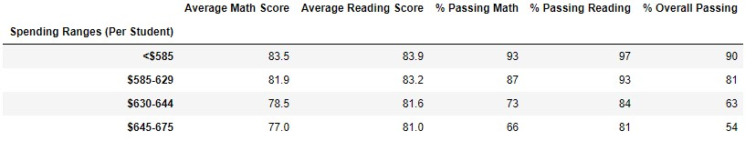

# School_District_Analysis
Analysis of the standardized testing scores of the high schools in a municipal school district

## Project Overview
An employee of the school district, Maria, requested an analysis be performed of the standardized testing scores for math and reading in the district's high schools. To work within the team, Anaconda was used to create a Development Environment with Python 3.7.9 and Jupyter Notebook. The analysis was pushed to a GitHub Repository, which this file describes.

## Resources
- Data Source: students_complete.csv, schools_complete.csv
- Software: Anaconda, Python 3.7.9, Jupyter Notebook

## Overview
The district comprises 15 high schools with a total of 39,170 students between them. The testing data in the csv files were placed into Pandas DataFrames to facilitate analysis while maintaining confidentiality of the students.

## Results
Correlations with test performance were checked across a number of variables: grade level, funding per student, school size, and school type:

 

Grade level didn't appear to have any correlation with performance. Funding per student appeared to have a negative correlation with performance, as did school size. As for school type, Charter schools outperformed District schools, but Charter schools were also exclusively rated as "small" or "medium" while all District schools fell into the "large" rating, so the two categories largely mirror each other, and it would require further study to determine which aspect may be more responsible for the performance contribution. 

Additionally, the top 5 and bottom 5 schools by Overall Passing % were isolated to see any similarities.

## Challenge Overview
Maria learned of allegations that one of the schools (Thomas High) may have been committing educational dishonesty with the scores of its 9th grade class. The challenge posed was to clean the data of scores for those students and see how much it affected the results.

## Challenge Results
* With the scores in question removed from the analysis, the broad strokes of the analysis still hold. Likely this is because the scores reported were very similar with other scores from the school. As this school was one of the higher performing schools (see above), removing a subset of its scores did, generally, reduce some averages.

* Naturally, removing all 9th grade scores from Thomas High had a profound impact on the analysis of average scores for 9th graders from Thomas High. Without any scores to analyze, the averages came back as null "NaN" values. However, as only these scores were removed from the analysis, it had no impact on any other cohort or any other school.

* Thomas High spent $638 per student in the previous academic year, placing it in the "$630-$644" bin. However, as this bin was heavily populated by larger district schools, the 461 scores removed were neither numerous enough, nor did they vary enough from the average of the group, to have any effect greater than a rounding error.

* Same with school size (Thomas being a "Medium" school).

* And school type (Thomas being a Charter School).

* Given the minimal impact seen so far from removing these data from the analysis, it should not come as a surprise that Thomas High remained in the Top 5 performing schools, though its averages were slightly affected. The school's average math score and each of the 3 passing percentages dropped slightly with the removal of the 9th grade data. Curiously enough, given the allegations, the average reading score of the school rose with the removal of the suspect grades.

* As Thomas High School was not in the Bottom 5 performing schools either before or after removing the suspect data, their removal had no effect on any results for the Bottom 5 performing schools. 

## Challenge Summary
On the whole, removing the 461 students' scores (of 39,170) didn't, generally speaking, have too many significant impacts. Of course, the greatest impacts were seen in the average reading and math scores of Thomas High 9th Graders, which could no longer be calculated, as the entirety of their source data had been removed from analysis. After these results, the next set of results to see noticeable changes from the removal of the scores were the average scores and passing percentages of Thomas High School itself. Again, as these 461 students made up roughly 25% of the data being used to calculate these numbers, it's not surprising that they were the next most affected. Once Thomas High's data were aggregated with other schools', the impact of removing these data wasno longer measurable.
